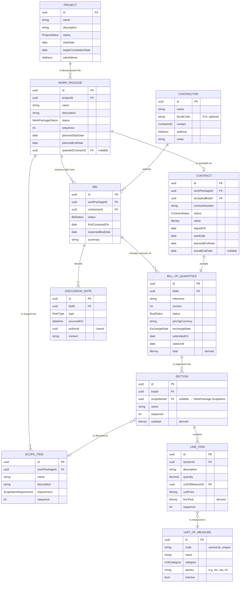

# Domain Model

- **Status:** Draft
- **Date:** 2026-06-22
- **Related:** [Project Overview](../project-overview.md), [Architecture](./README.md)

## Purpose

This document defines the core domain model for Home Project Management,
following **Domain-Driven Design (DDD)**. It establishes the ubiquitous
language (the shared vocabulary the four stakeholders and the code both use)
and the relationships between entities.

This is an evolving document. It currently captures the **entities, their
relationships, aggregate boundaries, and attributes**. Remaining open points are
tracked in [Open questions](#open-questions).

## Ubiquitous language

These are the agreed domain terms. The Romanian source terms are noted because
contractors' source documents (`deviz`) arrive in Romanian, and the model must
map onto them cleanly.

| Domain term | Romanian source | Meaning |
| --- | --- | --- |
| **Project** | — | The duplex build being tracked. The top-level thing everything hangs off. |
| **Work Package** | _categorie de lucrări / lucrare_ | A defined scope of work within a project that is procured as a unit (e.g. La Roșu, Tâmplărie, Instalații Sanitare, Bransament Gaz). Defined up front, **before** any contractor exists; contractors are then found per work package. Friendly alias: "Scope of Work". |
| **Scope Item** | _componentă de lucrare_ | An **owner-defined sub-scope of a single Work Package** (e.g. within "Instalații termice": Încălzire pardoseală, Cameră tehnică gaz, Răcire tavan, Ventilare cu recuperare). Defined up front as part of *your* scoping — distinct from a Section, which is one *contractor's* internal breakdown of their quote. Each Scope Item is **Mandatory or Optional**, which drives "what can we drop if money is tight?". A contractor's BoQ Sections are allocated to Scope Items so a quote rolls up per scope item for side-by-side comparison. |
| **Contractor** | _antreprenor / ofertant_ | A construction **firm** (master data: name, fiscal code, contact). Exists independently of any project, and may bid on — and be selected for — several work packages. The firm is one entity; the *role* it plays per work package is captured by **Bid** (during selection) and **Contract** (after selection), not by duplicating the firm. |
| **Bid** | _ofertă_ | A contractor's participation in **one work package's selection process**. Created when discussions begin (possibly before any quote), it records the **discussion notes**, carries a **status**, and groups the **BoQ version(s)** that contractor submits. One Bid per (work package, contractor). |
| **Discussion note** | _notă / minută_ | A timestamped note in a Bid's discussion log (a meeting, call, email, or remark with a contractor about a work package). Lives inside the Bid. |
| **Bill of Quantities (BoQ)** | _deviz de cheltuieli / deviz_ | A contractor's priced, itemized cost estimate submitted **within a Bid** (for that Bid's single work package). A Bid may have several BoQ versions over negotiation; each BoQ covers exactly one work package. |
| **Contract** | _contract / atribuire_ | The award for a work package: when a Bid is selected, a contract is created from that Bid's accepted BoQ. A work package has at most one contract; the contract references the accepted BoQ and thereby its Bid and contractor. |
| **Section** | _capitol de deviz_ | A grouping of line items **inside a single BoQ** (e.g. Foundation, Structure, Roof within a La Roșu quote). This is the *internal structure of one quote*, distinct from a Work Package (the *procurement unit*). |
| **Line item** | _articol de deviz_ | A single priced row within a section: description, quantity, unit, unit price, total. |
| **Unit of measure** | _unitate de măsură_ | A canonical unit used by line items (m³, m², m, pcs, kg, hrs). Controlled reference vocabulary. |
| **User / Stakeholder** | — | One of the four people who may access the tool. Handled by authentication; an identity/access concern rather than part of the costing domain. |

## Entities and relationships



A **Bid** sits at the intersection of a **Work Package** (what is being procured)
and a **Contractor** (who is participating) — one Bid per pair. A Bid records the
**discussion notes** and groups the **BoQ version(s)** that contractor submits.
When one Bid is **selected**, a **Contract** is created from its accepted BoQ —
at most one contract per work package.

A **Work Package** is also broken down into **Scope Items** — owner-defined
sub-scopes (e.g. "Instalații termice" → Încălzire pardoseală, Cameră tehnică gaz,
Ventilare cu recuperare), each flagged **Mandatory** or **Optional**. Scope Items
are *your* scoping, defined up front, and are not the same as a BoQ's Sections (one
contractor's internal breakdown). To compare prices per sub-scope, each BoQ
**Section is allocated to a Scope Item** (`scopeItemId`), so a contractor's quote
rolls up per scope item. This produces the per-scope-item comparison overview —
e.g. for "Instalații termice":

```
Scope Item                    Requirement   Offers
Încălzire pardoseală          Mandatory     C1 5k · C2 7k
Cameră tehnică gaz            Mandatory     C1 7k
Ventilare cu recuperare       Optional      C2 10k
```

The offer count differs per scope item because each contractor's BoQ only contains
sections for the scope items they actually priced; sections left unallocated
(`scopeItemId` null) count as general/uncategorized cost. An "offer" for a scope
item is its subtotal within the contractor's **current BoQ version**.

### Relationship summary

| From | To | Cardinality | Notes |
| --- | --- | --- | --- |
| Project | Work Package | one-to-many | A project is decomposed into work packages, defined up front. |
| Work Package | Scope Item | one-to-many | A work package is scoped into owner-defined scope items (mandatory/optional), defined up front. |
| Work Package | Bid | one-to-many | A work package receives competing bids, one per participating contractor. |
| Contractor | Bid | one-to-many | A contractor may bid on several work packages. (One Bid per work-package/contractor pair.) |
| Bid | Discussion note | one-to-many | A bid accumulates a timestamped discussion log. |
| Bid | Bill of Quantities | one-to-many | A bid may contain several BoQ versions over negotiation. |
| Work Package | Contract | one-to-zero-or-one | A work package has at most one contract, created once a bid is selected. |
| Contract | Bill of Quantities | one-to-one | A contract is created from exactly one accepted BoQ; its bid and contractor are reached through that BoQ. |
| Bill of Quantities | Section | one-to-many | A BoQ is split into internal sections. |
| Section | Line item | one-to-many | A section groups individual priced line items. |
| Section | Scope Item | many-to-zero-or-one | A BoQ section is optionally allocated to one Work Package scope item (loose id reference), so the quote rolls up per scope item. |
| Line item | Unit of measure | many-to-one | Each line item references one canonical unit. |

### Hierarchy at a glance

```
Project (the duplex build)
 └─ Work Package (La Roșu, Tâmplărie, Instalații Sanitare, Bransament Gaz, …)   ← defined first
     ├─ Scope Item (owner-defined sub-scope; Mandatory/Optional)   ← defined up front too
     ├─ Bid (one per participating contractor)
     │   │   └─► Contractor (the firm)
     │   ├─ Discussion note (meetings, calls, emails — from first contact)
     │   └─ Bill of Quantities (BoQ version submitted in this bid)
     │       └─ Section (Foundation, Structure, Roof — internal grouping of one quote)
     │           │   └─► Scope Item (optional allocation, for per-scope-item rollup)
     │           └─ Line item (description, qty, unit, unit price, total)
     │               └─► Unit of Measure (reference table)
     └─ Contract (created when one bid is selected; at most one per work package)
         └─► accepted Bill of Quantities (and thereby its Bid + Contractor)
```

### Example work packages

These are real work packages for the duplex build (Romanian source → English gloss):

| Work Package (RO) | English gloss |
| --- | --- |
| La Roșu | Structural shell / rough construction (foundation, structure, roof shell) |
| Tâmplărie | Joinery (windows & doors) |
| Instalații Sanitare | Plumbing / sanitary installations |
| Instalații Electrice | Electrical installations |
| Instalații Răcire | Cooling / HVAC installations |
| Bransament Curent | Electrical (power) utility connection |
| Bransament Gaz | Gas utility connection |

## Unit of Measure — reference data

`Unit of Measure` is a **controlled vocabulary**, not free text. This prevents
the same unit appearing as `m³`, `mc`, `m3`, and `cubic meter` across different
contractors' quotes, which would break side-by-side comparison.

- Seeded with the standard construction units; not freely editable by every user
  (an admin may add a missing unit).
- Line items hold a **foreign key** to the unit, never the raw string.
- A Romanian **alias/abbreviation** should be supported so source `deviz` units
  normalize onto one canonical unit:

| Romanian | Canonical | Meaning |
| --- | --- | --- |
| `mc` | m³ | Cubic metre (volume) |
| `mp` | m² | Square metre (area) |
| `ml` | m | Linear metre (length) |
| `buc` | pcs | Piece (count) |
| `to` | t | Tonne (mass) |

## Aggregates

DDD aggregate boundaries define transactional consistency, what is loaded and
saved as a unit, and what may be referenced from outside. The guiding rules
applied here:

- **Only aggregate roots are referenced from other aggregates** — always by
  **identity (id)**, never by holding the other object. This is the rule that
  decides most boundaries below.
- **Keep aggregates small**; group entities together only when a true invariant
  must hold between them at all times.
- **One repository per aggregate root.**

### Decided aggregates

| Aggregate root | Contains (internal entities) | References (by id) | Why a root |
| --- | --- | --- | --- |
| **Project** | — | — | The build's own lifecycle; top of the model. |
| **Work Package** | Scope Item | Project | Referenced by BoQ and Contract from outside, so it **must** be a root. Defined up front, independent lifecycle. Owns its Scope Items. |
| **Contractor** | — | — | A firm exists independently of any project/bid; referenced by Bid. |
| **Bid** | Discussion note | Work Package, Contractor | The selection process for one work-package/contractor pair. Referenced by BoQ from outside, so it must be a root; owns the discussion log. |
| **Bill of Quantities** | Section, Line item | Bid | Loaded, priced, and compared as a whole. Its sections/line items have no meaning or external references outside it. |
| **Contract** | — | Work Package, accepted BoQ | Its own lifecycle (status, signed date, value, documents) that evolves after the award; future payments/invoices will reference it directly. |
| **Unit of Measure** | — | — | Shared, managed reference vocabulary referenced by line items. |

**Section** and **Line item** are **local entities inside the Bill of Quantities
aggregate** — they have identity *within* the BoQ but are never referenced from
outside it, so the BoQ root owns their whole lifecycle. (Section is kept as an
entity rather than a value object because it carries a name, ordering, and its
own subtotal.)

**Discussion note** is a **local entity inside the Bid aggregate** — the bid's
discussion log; it is never referenced from outside the bid.

**Scope Item** is a **local entity inside the Work Package aggregate** — an
owner-defined sub-scope created, ordered, and deleted with its work package, with
no lifecycle of its own. It carries a name, a `requirement` (Mandatory/Optional),
and ordering. A BoQ **Section** may reference a Scope Item by id (`scopeItemId`) to
allocate its cost to that sub-scope.

> **Deliberate exception:** a `Section` (inside the BoQ aggregate) referencing a
> `ScopeItem` (a *local entity*, not a root) bends the rule "only aggregate roots
> are referenced across aggregates." We accept it because a Scope Item has no
> lifecycle outside its Work Package — promoting every owned sub-list to a root
> would bloat the model. The reference is **loose**: it is a plain `scopeItemId`
> validated by the **application service** (the same way cross-aggregate parents
> are already checked), not an EF navigation, and a deleted/absent scope item
> simply degrades the rollup to "unallocated" rather than breaking the BoQ. If we
> later need to query or manage scope items independently, ScopeItem can be
> promoted to its own root referencing the work package by id (mirroring
> `UnitOfMeasure`) — a cheap refactor. Flag this if preferred.

**User / Stakeholder** is **not** part of this domain model — it belongs to the
authentication/identity concern (a separate bounded context). Where the domain
needs it, it appears only as a `UserId` value in audit fields (e.g. *created by*).

### Invariants by aggregate

- **Bid** — belongs to exactly one Work Package and one Contractor; **at most one
  Bid per work-package/contractor pair**; at most one Bid per work package may be
  in status `Selected`.
- **Bill of Quantities** — BoQ total = sum of section totals = sum of line-item
  totals; every line item references a valid Unit of Measure; all `Money` fields
  share the BoQ's `pricingCurrency`; the BoQ belongs to exactly one Bid.
- **Contract** — at most **one** per Work Package; references an *accepted* BoQ
  whose Bid belongs to the **same** Work Package and is `Selected`.
- **Work Package** — belongs to exactly one Project; has a status lifecycle
  (e.g. open for bids → awarded); owns its **Scope Items**, each with a unique name
  within the work package and a `requirement` (Mandatory/Optional).
- **Scope Item** (inside Work Package) — belongs to exactly one Work Package; name
  unique within that work package. When a BoQ Section sets `scopeItemId`, the
  application service validates it points at a Scope Item of the **same** Work
  Package as the Section's BoQ (reached via Bid → Work Package).
- **Unit of Measure** — unique canonical code; cannot be deleted while a line
  item references it.

### Cross-aggregate consistency

Because aggregates are saved one at a time, operations that touch two roots are
coordinated by an **application service** (and may use **domain events** for
eventual consistency):

- **Selecting a bid / awarding a work package**: marks one **Bid** as `Selected`
  (and the others `Rejected`), creates a **Contract** from that bid's accepted
  **BoQ**, and transitions the **Work Package** status to *awarded*. This spans
  three aggregates and is coordinated by the application service. The "at most one
  contract per work package" rule is additionally guarded by a unique constraint
  on `Contract.workPackageId`; "one bid per work-package/contractor pair" by a
  unique constraint on `Bid (workPackageId, contractorId)`.

> One deliberate judgement call: **Contract is its own root** rather than an
> entity inside Work Package. The trade-off is that awarding spans two aggregates
> (handled above); in return the Contract keeps a small, independent lifecycle and
> stays directly referenceable by later concerns (payments, invoices, progress).
> If we would rather make awarding a single atomic transaction, Contract can move
> inside the Work Package aggregate — flag this if preferred.

## Attributes

Types are language-neutral (`Money`, `Address`, etc. are value objects defined
below). `id` fields are the aggregate's identity; `*Id` fields are references to
other aggregate roots **by identity**. Derived fields are computed, not stored as
source of truth (they may be cached for query performance).

### Value objects

Value objects have no identity of their own; they are compared by value and are
immutable.

| Value object | Fields | Used by |
| --- | --- | --- |
| **Money** | `amount` (decimal), `currency` (ISO 4217 code: RON or EUR) | BoQ total, Section subtotal, Line item unit price & total, Contract value |
| **ExchangeRate** | `baseCurrency`, `quoteCurrency`, `rate` (decimal), `asOf` (date) | BoQ (to present EUR and RON side by side) |
| **Address** | `street`, `city`, `county` (județ), `postalCode`, `country` | Project (site), Contractor |
| **ContactInfo** | `personName`, `email`, `phone` | Contractor |
| **DateRange** *(optional)* | `start`, `end` | Could replace planned start/end pairs on Work Package / Contract |
| **DocumentReference** *(future)* | `fileName`, `url`, `uploadedOn`, `uploadedBy` (UserId) | Contract attachments |

**Dual currency (EUR + RON).** Contractors price a BoQ in one currency
(`pricingCurrency`, EUR or RON) but both EUR and RON figures are typically needed.
Rather than storing two independently-entered amounts that may not reconcile, a
BoQ pins one **`ExchangeRate`** (e.g. 1 EUR = 4.97 RON, `asOf` a date). All
`Money` amounts are stored in the `pricingCurrency`; the other currency is
**derived** via the rate for display and comparison. This keeps a single source
of truth. (If a contractor ever supplies genuinely independent EUR and RON
prices, revisit storing dual amounts — noted in Open questions.)

**Audit fields** apply to every aggregate root and are omitted from the tables
below for brevity: `createdOn` (timestamp), `createdBy` (UserId), `modifiedOn`
(timestamp), `modifiedBy` (UserId). `UserId` is a reference into the
authentication context, not a domain entity.

### Enums

| Enum | Values |
| --- | --- |
| **ProjectStatus** | Planning, InProgress, OnHold, Completed |
| **WorkPackageStatus** | Defined, OpenForBids, Awarded, InProgress, Completed, Cancelled |
| **ScopeItemRequirement** | Mandatory, Optional |
| **BidStatus** | InDiscussion, BoqExpected, BoqReceived, Shortlisted, Selected, Rejected, Withdrawn |
| **NoteType** | Meeting, Call, Email, Note |
| **BoqStatus** | Draft, Submitted, Accepted, Rejected, Withdrawn |
| **ContractStatus** | Draft, Signed, Active, Completed, Terminated |
| **UnitCategory** | Length, Area, Volume, Mass, Count, Time, Other |

### Project

| Attribute | Type | Notes |
| --- | --- | --- |
| id | ProjectId | Identity. |
| name | string | e.g. "Duplex Build". |
| description | string | Optional. |
| status | ProjectStatus | |
| startDate | date | When the build starts/started. |
| targetCompletionDate | date | The overall target date (was the old `dueDate`). |
| siteAddress | Address | The build location. Optional. |

### Work Package

| Attribute | Type | Notes |
| --- | --- | --- |
| id | WorkPackageId | Identity. |
| projectId | ProjectId | Owning project (by id). |
| name | string | e.g. "La Roșu", "Tâmplărie". |
| description | string | Optional scope notes. |
| status | WorkPackageStatus | Lifecycle; `Awarded` implies `awardedContractId` is set. |
| sequence | int | Display/intended order (La Roșu before Tâmplărie …). |
| plannedStartDate | date | Optional — captures the "milestone"/timeline aspect. |
| plannedEndDate | date | Optional target completion for this package. |
| awardedContractId | ContractId? | Null until awarded; convenience reference to the contract. |
| scopeItems | ScopeItem[] | Internal entities (ordered) — the owner-defined sub-scopes. |

### Scope Item (inside Work Package)

| Attribute | Type | Notes |
| --- | --- | --- |
| id | ScopeItemId | Local identity within the Work Package aggregate. |
| name | string | e.g. "Ventilare cu recuperare". Unique within the work package. |
| description | string | Optional scope notes. |
| requirement | ScopeItemRequirement | Mandatory / Optional — drives "what can we drop if money is tight?". |
| sequence | int | Display order within the work package. |

### Contractor

| Attribute | Type | Notes |
| --- | --- | --- |
| id | ContractorId | Identity. |
| name | string | Company name. |
| fiscalCode | string | Romanian CUI. Optional. |
| registrationNumber | string | Nr. Reg. Com. (J-number). Optional. |
| contact | ContactInfo | Primary contact person. |
| address | Address | Optional. |
| notes | string | Optional. |

### Bid

| Attribute | Type | Notes |
| --- | --- | --- |
| id | BidId | Identity (aggregate root). |
| workPackageId | WorkPackageId | The work package being procured (by id). |
| contractorId | ContractorId | The participating contractor (by id). |
| status | BidStatus | Lifecycle `InDiscussion → BoqExpected → BoqReceived → Shortlisted → Selected`/`Rejected`/`Withdrawn`. `Selected` is what a Contract is created from; at most one Selected per work package. `BoqReceived` (a priced BoQ arrived) supersedes the former `Quoted`. |
| firstContactedOn | date | When discussions began. Optional. |
| expectedBoqDate | date | When the contractor committed to send a BoQ (set with `BoqExpected`). Optional. |
| summary | string | Short free-text summary/standing of the bid. Optional. |
| notes | DiscussionNote[] | Internal entities (the discussion log). |

### Discussion note (inside Bid)

| Attribute | Type | Notes |
| --- | --- | --- |
| id | DiscussionNoteId | Local identity within the Bid aggregate. |
| type | NoteType | Meeting / Call / Email / Note. |
| occurredOn | datetime | When it happened. |
| authorId | UserId | Which stakeholder logged it (auth context). |
| content | string | The note text. |

### Bill of Quantities

| Attribute | Type | Notes |
| --- | --- | --- |
| id | BoqId | Identity (aggregate root). |
| bidId | BidId | The bid this BoQ belongs to (by id); work package & contractor reached through it. |
| reference | string | The contractor's own `deviz` number/label. Optional. |
| version | int | BoQ revision within the bid (1, 2, …). |
| status | BoqStatus | `Accepted` is what a Contract is created from. |
| pricingCurrency | string (ISO 4217) | RON or EUR — the currency all `Money` fields are stored in. |
| exchangeRate | ExchangeRate | Pinned EUR↔RON rate so the other currency is derivable. |
| submittedOn | date | When the quote was received. |
| validUntil | date | Offer expiry. Optional. |
| total | Money (derived) | Sum of section subtotals. |
| sections | Section[] | Internal entities (ordered). |

### Section (inside BoQ)

| Attribute | Type | Notes |
| --- | --- | --- |
| id | SectionId | Local identity within the BoQ aggregate. |
| scopeItemId | ScopeItemId? | Optional loose reference to a Scope Item of the BoQ's Work Package, allocating this section's cost to that sub-scope for per-scope-item rollup. Null = unallocated. Validated in the application service. |
| name | string | e.g. "Foundation", "Roof". |
| sequence | int | Order within the BoQ. |
| description | string | Optional. |
| subtotal | Money (derived) | Sum of its line-item totals. |
| lineItems | LineItem[] | Internal entities (ordered). |

### Line item (inside Section)

| Attribute | Type | Notes |
| --- | --- | --- |
| id | LineItemId | Local identity within the BoQ aggregate. |
| description | string | The work/material item. |
| quantity | decimal | |
| unitOfMeasureId | UnitOfMeasureId | Reference to canonical unit (by id). |
| unitPrice | Money | Price per unit. |
| lineTotal | Money (derived) | `quantity × unitPrice`. |
| sequence | int | Order within the section. |
| notes | string | Optional. |

### Contract

| Attribute | Type | Notes |
| --- | --- | --- |
| id | ContractId | Identity (aggregate root). |
| workPackageId | WorkPackageId | The awarded work package (by id). |
| acceptedBoqId | BoqId | The accepted BoQ this contract is based on (by id). Contractor is reached through it. |
| contractNumber | string | Optional. |
| status | ContractStatus | |
| value | Money | Agreed value; defaults to the accepted BoQ total but may be negotiated. |
| signedOn | date | Optional until signed. |
| startDate | date | Optional. |
| plannedEndDate | date | Optional. |
| actualEndDate | date? | Set on completion. |
| documents | DocumentReference[] | Optional / future. |
| notes | string | Optional. |

### Unit of Measure (reference data)

| Attribute | Type | Notes |
| --- | --- | --- |
| id | UnitOfMeasureId | Identity. |
| code | string | Canonical symbol, unique (e.g. `m³`). |
| name | string | e.g. "Cubic metre". |
| category | UnitCategory | |
| aliases | string[] | Romanian/source abbreviations (`mc`, `mp`, `ml`, …) normalized to this unit. |
| isActive | bool | Retire a unit without deleting it. |

## Open questions

- [x] **Attributes defined** for each entity, with value objects (Money,
  ExchangeRate, Address, ContactInfo) and enums. (See [Attributes](#attributes).)
- [x] **Selection process modelled** — the firm is one `Contractor`; its role per
  work package is a **`Bid`** (with a `DiscussionNote` log and BoQ versions) during
  selection and a **`Contract`** after. Contractor is *not* split into two entities.
- [x] **Currency policy** — RON + EUR. A BoQ is priced in one `pricingCurrency`;
  both currencies are derived via a pinned `ExchangeRate` (single source of truth).
- [ ] **Independent dual amounts** — if a contractor ever gives non-reconciling
  EUR *and* RON prices (not a straight conversion), revisit storing both. Deferred.
- [x] **Derived totals computed on read** (BoQ total, section subtotal, line
  total); may be cached later only if query performance needs it.
- [x] **Contract documents deferred** — `DocumentReference` kept as a placeholder.
- [x] **Aggregate roots and boundaries confirmed** — seven roots: Project, Work
  Package, Contractor, Bid, Bill of Quantities, Contract, Unit of Measure. Section
  & Line item are local to the BoQ aggregate; Discussion note is local to the Bid
  aggregate. (See [Aggregates](#aggregates).)
- [x] **Awarded BoQ is modelled as a full `Contract` entity** (one per work
  package, created from the selected bid's accepted BoQ).
- [x] **One BoQ per work package** — each BoQ covers a single work package; a bid
  may hold several BoQ *versions* of it.
- [x] **Work Package sub-scopes modelled as `ScopeItem`s** — owner-defined,
  Mandatory/Optional, local entities inside the Work Package aggregate. BoQ
  Sections are loosely allocated to a Scope Item (`scopeItemId`) so each
  contractor's quote rolls up per scope item for side-by-side comparison. (See the
  deliberate exception note in [Aggregates](#aggregates).)
- [ ] **Section-vs-line-item allocation granularity** — Scope Items are allocated
  at the **Section** level. If a contractor bundles two scope items in one section,
  either split the section or (future) allow allocation at the **line-item**
  level. Deferred until reality forces it.
- [ ] **Budgeting / affordability layer** — the driver for Scope Items is "do we
  have enough money for *Ventilare cu recuperare*?". A future layer could add a
  budget per Work Package/Scope Item and "scenarios" that toggle Optional scope
  items in/out and recompute the total. Deferred; `requirement` on Scope Item is
  defined now so this needs no remigration later.
- [ ] Whether **actual-cost / payment tracking** is added later (deferred —
  out of scope for the initial estimate-comparison model).
- [ ] How **User / Stakeholder** relates to the model, if at all, beyond
  authentication (e.g. audit fields like "created by").
