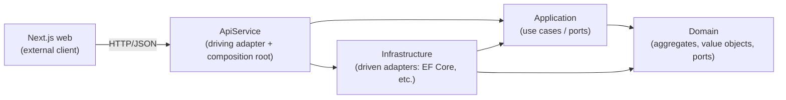

# Hexagonal Architecture & Domain Mapping

- **Status:** Draft
- **Date:** 2026-06-22
- **Related:** [Domain Model](./domain-model.md), [Project Overview](../project-overview.md), [Architecture](./README.md)

## Purpose

This document maps the [Domain Model](./domain-model.md) onto a concrete
**Domain-Driven Design + Hexagonal (ports & adapters)** code structure for the
backend, satisfying the architecture mandate. It defines the projects, the
dependency rule, where each aggregate's artifacts live, and the ports/adapters.

### Decisions baked in

| Decision | Choice |
| --- | --- |
| Solution layout | **4 projects**: Domain, Application, Infrastructure, ApiService |
| Application layer | **Lightweight application services** (interface + class per aggregate); no MediatR |
| Aggregate identities | **Strongly-typed IDs** (e.g. `BidId`) with EF Core value converters |

## The dependency rule

The domain core depends on nothing. Everything points **inward**. Infrastructure
and the web host depend on the application/domain, never the reverse.



- **Domain** — pure C#, no framework references. Aggregates, entities, value
  objects, domain events, and **port interfaces** (repositories).
- **Application** — depends on Domain only. Use-case services, DTOs, and
  secondary ports for external services (exchange rate, current user). Time
  comes from the BCL `TimeProvider`, so no custom clock port is needed.
- **Infrastructure** — depends on Application + Domain. Implements the ports:
  EF Core persistence, exchange-rate source, etc.
- **ApiService** — depends on Application + Infrastructure. Minimal-API endpoints
  (the driving adapter) and the DI composition root. Also keeps the existing
  Aspire `ServiceDefaults` wiring and the `projectsdb` connection.

`AppHost` and `ServiceDefaults` are unchanged; `web` stays an external driving
adapter that talks to ApiService over HTTP.

## Solution layout

```
src/
  HomeProjectManagement.Domain/            ← new; no project references
  HomeProjectManagement.Application/       ← new; → Domain
  HomeProjectManagement.Infrastructure/    ← new; → Application, Domain
  HomeProjectManagement.ApiService/        ← exists; → Application, Infrastructure
  HomeProjectManagement.AppHost/           ← unchanged
  HomeProjectManagement.ServiceDefaults/   ← unchanged
  web/                                     ← unchanged (Next.js)
```

All three new projects are added to `HomeProjectManagement.slnx`.

### Domain project — organised by aggregate (package-by-aggregate)

```
Domain/
  Common/
    Entity.cs                 (base: identity equality)
    AggregateRoot.cs          (base: domain events, version)
    ValueObject.cs            (base: structural equality)
    IStronglyTypedId.cs       (marker for the EF id-converter convention)
    IRepository.cs            (generic root repository port)
    IUnitOfWork.cs            (commit boundary port)
    DomainEvent.cs
    ValueObjects/
      Money.cs                ExchangeRate.cs
      Address.cs              ContactInfo.cs
      DocumentReference.cs    DateRange.cs
      UserId.cs               (reference to the auth context)
  Projects/
    Project.cs (root)  ProjectId.cs  ProjectStatus.cs  IProjectRepository.cs
  WorkPackages/
    WorkPackage.cs (root)  WorkPackageId.cs  WorkPackageStatus.cs  IWorkPackageRepository.cs
  Contractors/
    Contractor.cs (root)  ContractorId.cs  IContractorRepository.cs
  Bids/
    Bid.cs (root)  DiscussionNote.cs  BidId.cs  BidStatus.cs  NoteType.cs  IBidRepository.cs
  BillsOfQuantities/
    BillOfQuantities.cs (root)  Section.cs  LineItem.cs
    BoqId.cs  BoqStatus.cs  IBillOfQuantitiesRepository.cs
  Contracts/
    Contract.cs (root)  ContractId.cs  ContractStatus.cs  IContractRepository.cs
  UnitsOfMeasure/
    UnitOfMeasure.cs (root)  UnitOfMeasureId.cs  UnitCategory.cs  IUnitOfMeasureRepository.cs
```

### Application project

```
Application/
  Abstractions/
    (time: use the BCL TimeProvider directly — no custom clock port)
    ICurrentUser.cs           (driven port: who is acting → UserId for audit)
    IExchangeRateProvider.cs  (driven port: EUR↔RON rate — manual entry)
    IDomainEventDispatcher.cs (driven port: dispatch domain events post-commit)
  Projects/        IProjectAppService.cs  ProjectAppService.cs  + DTOs/commands
  WorkPackages/    IWorkPackageAppService.cs  ...
  Contractors/     IContractorAppService.cs  ...
  Bids/            IBidAppService.cs  ...        (notes, versions, selection entry)
  BillsOfQuantities/ IBillOfQuantitiesAppService.cs  ...
  Contracts/       IContractAppService.cs  ...
  UnitsOfMeasure/  IUnitOfMeasureAppService.cs  ... (mostly queries / reference data)
  Awarding/        AwardWorkPackageService.cs   (cross-aggregate use case)
```

### Infrastructure project

```
Infrastructure/
  Persistence/
    AppDbContext.cs
    UnitOfWork.cs                         (implements IUnitOfWork)
    Configurations/                       (IEntityTypeConfiguration per aggregate)
      ProjectConfiguration.cs  WorkPackageConfiguration.cs  ContractorConfiguration.cs
      BidConfiguration.cs      BillOfQuantitiesConfiguration.cs
      ContractConfiguration.cs UnitOfMeasureConfiguration.cs
    Repositories/                         (implements the Domain repository ports)
      ProjectRepository.cs  WorkPackageRepository.cs  ...
    Conversions/
      StronglyTypedIdValueConverter.cs
    Migrations/                           (EF Core migrations live here)
    Seed/UnitOfMeasureSeeder.cs
  ExchangeRates/  ManualExchangeRateProvider.cs   (initial: rate entered per BoQ)
  Identity/       CurrentUser.cs          (reads the authenticated stakeholder)
  DependencyInjection.cs                  (AddInfrastructure extension)
```

### ApiService project (driving adapter + composition root)

```
ApiService/
  Endpoints/                              (minimal-API endpoint groups, thin)
    ProjectEndpoints.cs  WorkPackageEndpoints.cs  ContractorEndpoints.cs
    BidEndpoints.cs      BillOfQuantitiesEndpoints.cs  ContractEndpoints.cs
    UnitOfMeasureEndpoints.cs
  Program.cs                              (Aspire wiring, auth, AddInfrastructure, map endpoints)
```

Endpoints are thin: deserialize → call an application service → return a DTO.
No EF Core or domain logic in the host.

## Ports & adapters catalog

| Port (interface) | Kind | Defined in | Adapter (implementation) | In |
| --- | --- | --- | --- | --- |
| `IProjectAppService`, `IBidAppService`, … | Driving (primary) | Application | Minimal-API endpoints | ApiService |
| `IProjectRepository`, `IBidRepository`, … | Driven (secondary) | Domain | EF Core repositories | Infrastructure |
| `IUnitOfWork` | Driven | Domain (or Application) | EF `SaveChanges` transaction | Infrastructure |
| `IExchangeRateProvider` | Driven | Application | Manual entry (rate captured per BoQ) | Infrastructure |
| `TimeProvider` (BCL) | Driven | .NET BCL | `TimeProvider.System` | registered in Infrastructure DI |
| `ICurrentUser` | Driven | Application | Reads auth principal → `UserId` | Infrastructure |
| `IDomainEventDispatcher` | Driven | Application | In-process handler registry, post-commit | Infrastructure |

The Next.js frontend is itself a **driving adapter**, external to the .NET
solution, calling the API endpoints over HTTP.

## Aggregate → code mapping

| Aggregate | Domain folder | Root | Internal entities | Value objects used | Enums | Repository port |
| --- | --- | --- | --- | --- | --- | --- |
| Project | `Projects/` | `Project` | — | Address | ProjectStatus | `IProjectRepository` |
| Work Package | `WorkPackages/` | `WorkPackage` | — | DateRange* | WorkPackageStatus | `IWorkPackageRepository` |
| Contractor | `Contractors/` | `Contractor` | — | ContactInfo, Address | — | `IContractorRepository` |
| Bid | `Bids/` | `Bid` | DiscussionNote | — | BidStatus, NoteType | `IBidRepository` |
| Bill of Quantities | `BillsOfQuantities/` | `BillOfQuantities` | Section, LineItem | Money, ExchangeRate | BoqStatus | `IBillOfQuantitiesRepository` |
| Contract | `Contracts/` | `Contract` | — | Money, DocumentReference | ContractStatus | `IContractRepository` |
| Unit of Measure | `UnitsOfMeasure/` | `UnitOfMeasure` | — | — | UnitCategory | `IUnitOfMeasureRepository` |

\* DateRange optional — only if we replace planned start/end pairs.

Shared value objects (`Money`, `ExchangeRate`, `Address`, `ContactInfo`,
`DocumentReference`, `UserId`) live in `Domain/Common/ValueObjects` as a small
shared kernel inside the domain.

## Domain building blocks

- **Aggregates are encapsulated.** No public setters. State changes go through
  intention-revealing methods that enforce invariants (e.g.
  `bid.LogNote(...)`, `bid.AddBoqVersion(...)`, `boq.AddSection(...)`,
  `workPackage.Award(contract)`). Construction goes through factory methods that
  validate (e.g. `Bid.Start(workPackageId, contractorId, timeProvider)`).
  *This replaces the current anemic, public-setter `Project` class.*
- **Strongly-typed IDs.** Each root has an id type, e.g.
  `public readonly record struct BidId(Guid Value)`. References across aggregates
  use these id types (`Contract` holds `WorkPackageId` + `BoqId`), so the compiler
  prevents mixing identities.
- **Value objects** derive from `ValueObject` (structural equality, immutable).
- **Derived values** (BoQ total, section subtotal, line total) are **computed**
  in the domain, not stored.
- **Domain events** (adopted): aggregates raise events on state changes — e.g.
  `BidSelected`, `WorkPackageAwarded`, `ContractCreated` — collected on the
  `AggregateRoot` base and **dispatched after commit** by the unit of work. A
  small `IDomainEventDispatcher` port (Application) with an in-process handler
  registry (Infrastructure) wires this up.

## Application services & the cross-aggregate flow

Application services are thin orchestration over the domain. They open a unit of
work, load aggregate(s) via repository ports, invoke domain behaviour, and commit.
Audit fields are stamped from `ICurrentUser` + `TimeProvider`.

The **award** use case spans three aggregates (Bid, Contract, Work Package) and
is the canonical example:

```csharp
public sealed class AwardWorkPackageService(
    IBidRepository bids,
    IBillOfQuantitiesRepository boqs,
    IContractRepository contracts,
    IWorkPackageRepository workPackages,
    IUnitOfWork uow,
    TimeProvider timeProvider,
    ICurrentUser user) : IAwardWorkPackageService
{
    public async Task<ContractId> AwardAsync(BidId winningBidId, BoqId acceptedBoqId)
    {
        var bid = await bids.GetAsync(winningBidId);
        var boq = await boqs.GetAsync(acceptedBoqId);          // must belong to bid
        var wp  = await workPackages.GetAsync(bid.WorkPackageId);

        var siblings = await bids.ListByWorkPackageAsync(bid.WorkPackageId);
        foreach (var other in siblings) other.RejectIfNotSelected(bid.Id);
        bid.Select(boq.Id);                                    // BidStatus → Selected

        var contract = Contract.CreateFrom(bid, boq, timeProvider.GetUtcNow());
        wp.Award(contract.Id);                                 // WP status → Awarded

        contracts.Add(contract);
        await uow.CommitAsync();   // one transaction across the roots
        return contract.Id;
    }
}
```

The "at most one contract per work package" and "one bid per
work-package/contractor pair" invariants are also backed by unique constraints
(see [Domain Model → Cross-aggregate consistency](./domain-model.md#aggregates)).

## Persistence mapping (EF Core, Infrastructure)

- **One `IEntityTypeConfiguration` per aggregate.** The `AppDbContext` only
  exposes `DbSet`s for **aggregate roots**.
- **Repositories return whole aggregates** — e.g. `IBillOfQuantitiesRepository`
  eager-loads Sections + Line items; `IBidRepository` loads Discussion notes.
  Internal entities (Section, LineItem, DiscussionNote) have **no** repository.
- **Value objects** map as **owned types** (`OwnsOne`/`OwnsMany`): `Money` →
  `amount` + `currency` columns; `Address`, `ContactInfo`, `ExchangeRate` owned.
- **Strongly-typed IDs** map via a `ValueConverter` (`Guid` ↔ id type), applied
  by convention for all `IStronglyTypedId` types.
- **Enums** persist as strings (`HasConversion<string>()`), matching the existing
  `Project.Status` mapping and the frontend's string enums.
- **Migrations** live in `Infrastructure/Persistence/Migrations`; `Program.cs`
  keeps applying them on startup (`db.Database.Migrate()` after Aspire `WaitFor`).

## Migration path from the current code

The backend today is a single project with an inline minimal API, an anemic
`Project`, `AppDbContext`, and an `InitialCreate` migration. Suggested sequence:

1. **Add the three projects** (Domain, Application, Infrastructure) and wire
   references + `slnx`.
2. **Move `Project`** into `Domain/Projects` as a proper encapsulated aggregate
   (private setters, factory, behaviour); add `ProjectId`. Keep `ProjectStatus`.
3. **Move `AppDbContext` + Migrations** into Infrastructure; add the
   configuration + repository for Project; add `IProjectRepository`,
   `IUnitOfWork`, `ICurrentUser` (time via the BCL `TimeProvider`).
4. **Add `ProjectAppService`**; convert the `/api/projects` endpoints to call it
   (move them into `Endpoints/ProjectEndpoints.cs`). ApiService no longer touches
   EF Core directly.
5. **Regenerate the schema.** Since this is pre-production with no real data, drop
   the old `InitialCreate` and generate a fresh migration once the new mappings
   exist (or reset the dev volume).
6. **Add the remaining aggregates** incrementally (Work Package → Contractor →
   Bid + Discussion note → Bill of Quantities + Section + Line item → Contract →
   Unit of Measure), each with config + repository + app service + endpoints.

The frontend (`app/lib/api.ts` types, `app/actions.ts`) tracks the **DTOs** the
application services expose, not the domain entities — keep them in sync as
endpoints land.

## Resolved decisions

- [x] **Exchange-rate source** — **manual entry**; the rate is captured per BoQ
  via `IExchangeRateProvider`. (A BNR feed adapter can replace it later behind the
  same port.)
- [x] **Repository port location** — **Domain**. Aggregates own their persistence
  contract; interfaces live beside each aggregate.
- [x] **Domain events** — **adopted now**. Raised on `AggregateRoot`, dispatched
  post-commit via `IDomainEventDispatcher` (see Domain building blocks).
- [x] **Authentication** — **out of scope for now**. The `ICurrentUser` port
  stays (audit fields need a `UserId`); a temporary stub supplies it until the
  real sign-in adapter for the four stakeholders is designed separately.
